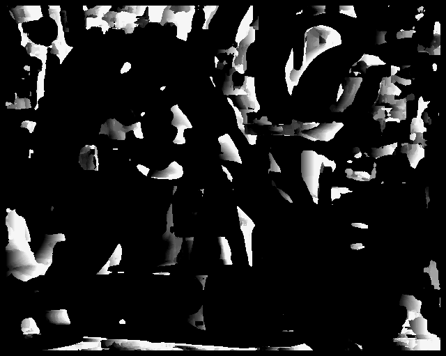
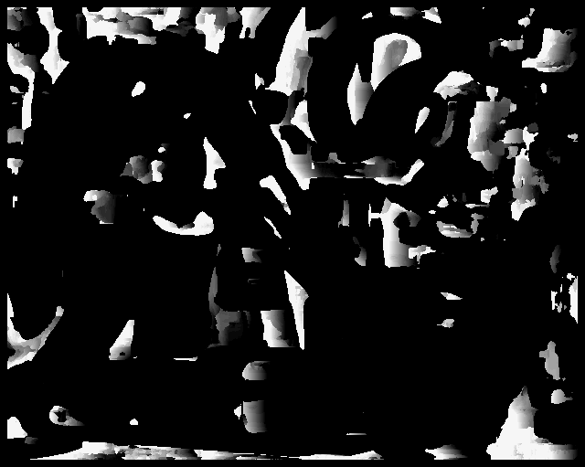

Disparity image using stereo. When a pair of left and right images are given and then the depth of the object is found using these pair of images 

 <b> Instructions to run the code </b> 

python3 filename.py path_to_left_img  path_to_right_img 

<h3> Results </h3> 

 <h4> Input image</h4>
  
   

<h4> Disparity Image left and Right for Window size 6 </h4> 

  
   

<h4> Disparity Image left and Right for Window size 8 </h4> 

  
   

