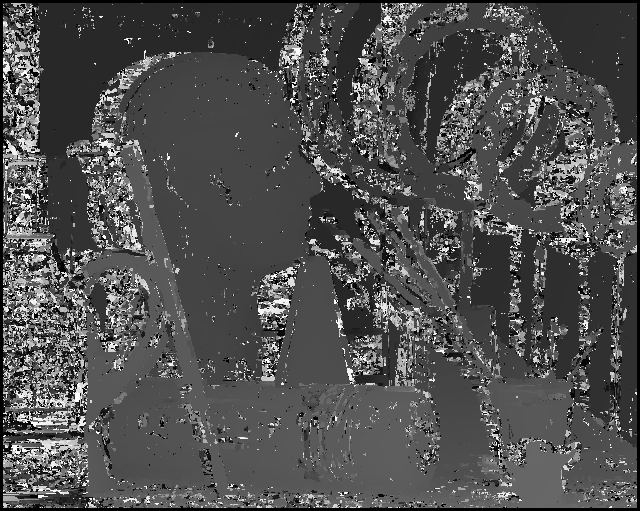
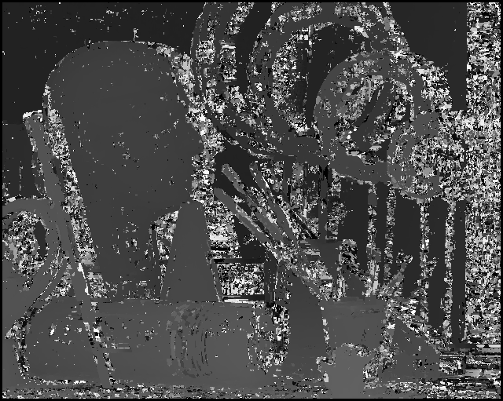
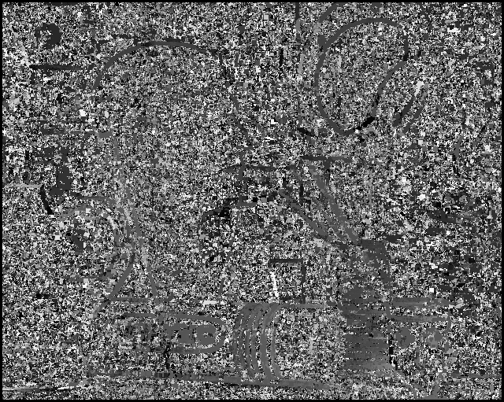
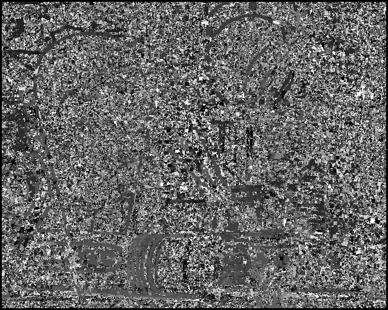

Disparity image using Normalized correlation. An improved method over stereo. Implemented using Opencv built in function CV_TM_CCOEFF_NORMED  

 <b> Instructions to run the code </b> 

python3 filename.py path_to_left_img  path_to_right_img 

<h3> Results </h3> 

 <h4> Input image left and right</h4>
  
   

<h4> Disparity Images using normalized correlation for Window size 6 </h4> 

  
   

<h4> Disparity Images using normalized correlation for Window size 6 with noise </h4> 

  
   

