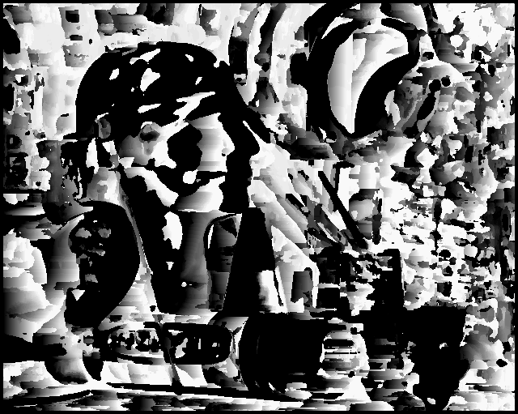
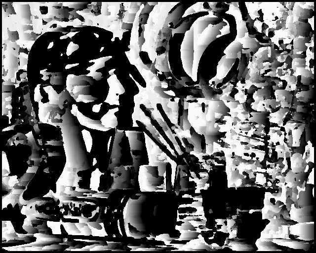

Disparity image after increasing the constrast of one of the images by 10 percent

 <b> Instructions to run the code </b> 

python3 filename.py path_to_left_img  path_to_right_img 

<h3> Results </h3> 

 <h4> Input image left and right</h4>
  
   

<h4> Disparity Image after increasing the contrast</h4> 

  
   

