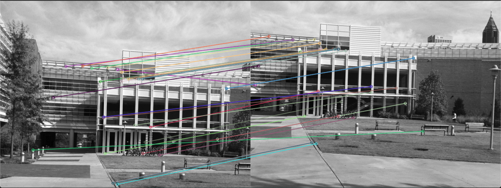

SIFT descriptor matching

Instructions for running the code 
python3 sift_descriptorfile path_to_the_image

Contains brute force method for matching the descriptors and KD tree matching for descriptors. 
Reference for KD tree implementation : https://github.com/stefankoegl/kdtree

<h2> Matching for simA and simB </h2> 

  

<h2> Matching for transA and transB  </h2> 

  
 

 
 

