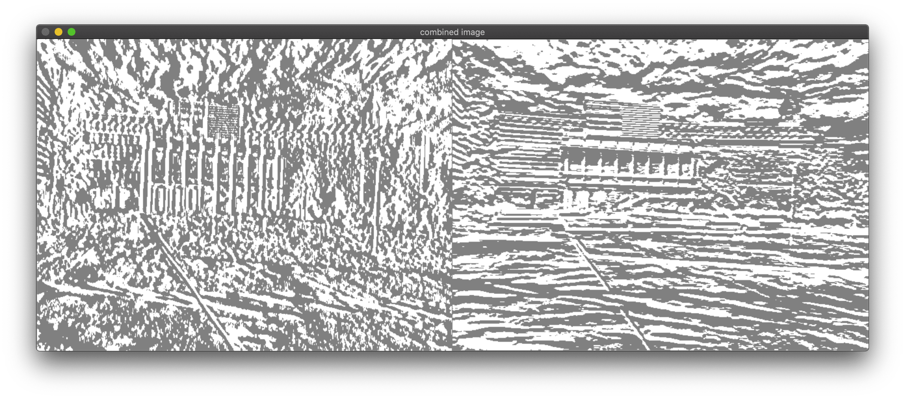
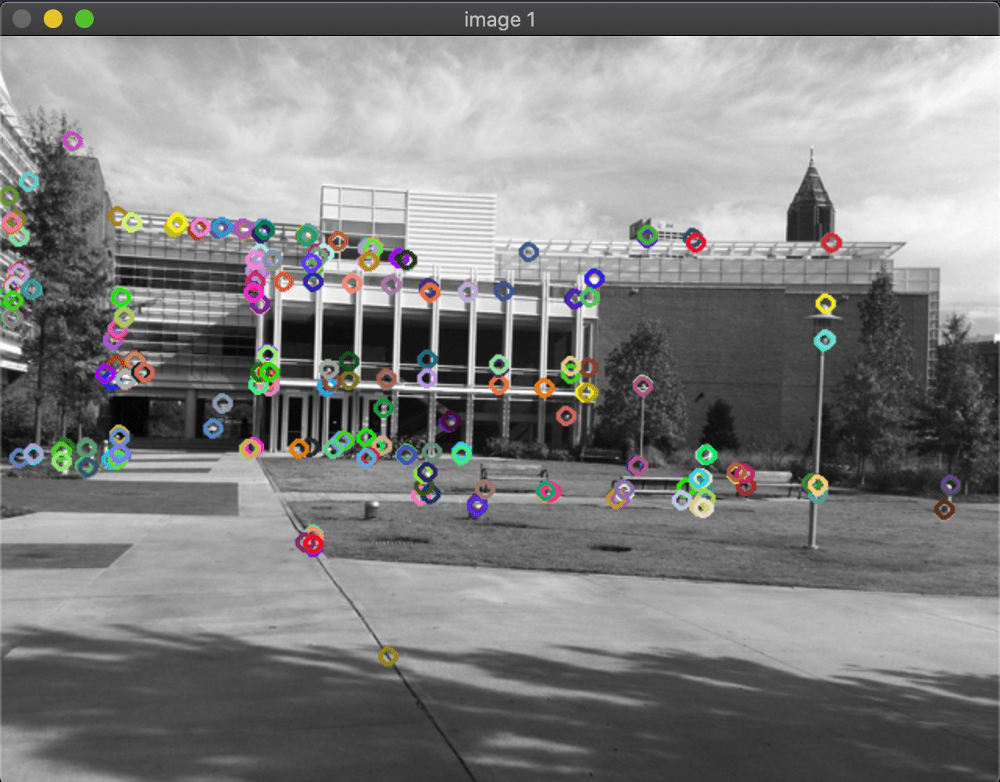

Harris corner python code 

Instructions for running the code 

python3 harris_corner.py path_to_the_image

python3 harris_corner.py ./check_board.png

 <h2> Input image</h2>
 

<h2> Image Gradient in X and Y direction Combined </h2> 

  

<h2> Harris corners for the image  </h2> 

 First input image and second is the harris response image ( R) and third is after Non Maximum suppression is applied to the image.

  
  
  
 

<h2> Corners drawn as circles  </h2> 

  
 
 
 

