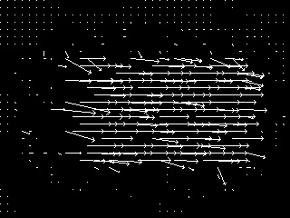

Lucas Kanade Optical flow 

Instructions for running the code 

C++ code make sure you have opencv installed.

 <h2> Frame 1 and Frame 2</h2>
 
 Frame 1 and  2 have a difference 0f 10 pixels so here iterative lucas kanade is  applied. 

 
  

<h2> Flow Map for the images </h2> 

 Arrows depicting the motion .

  
 

