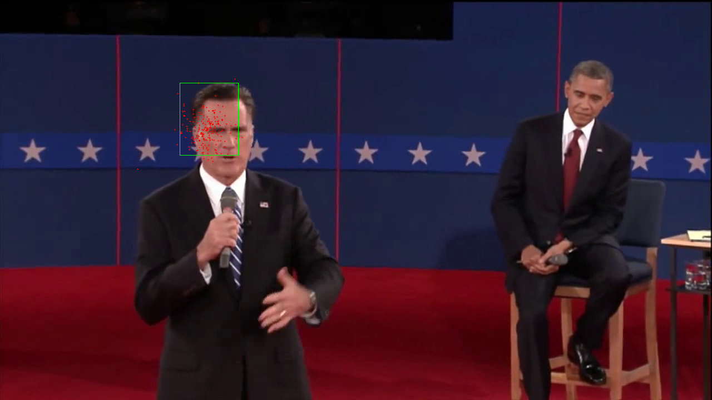
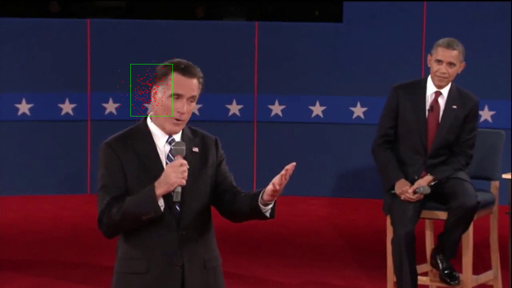
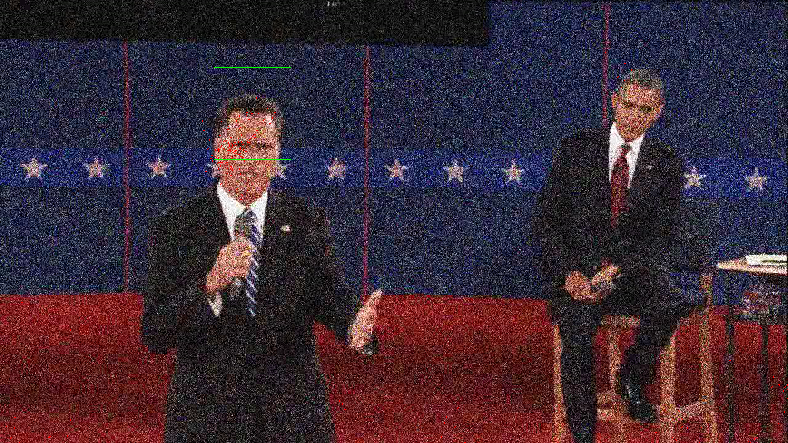
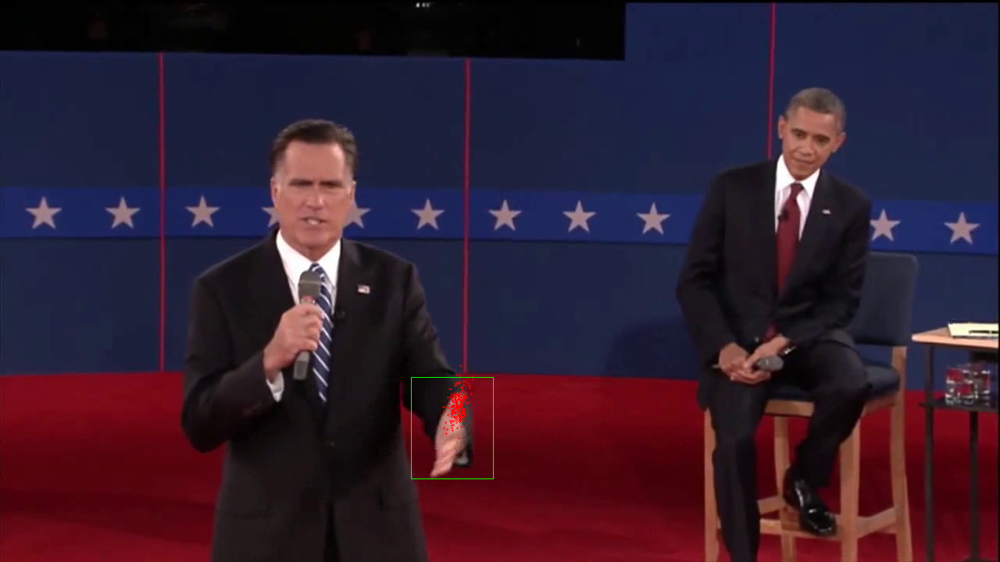
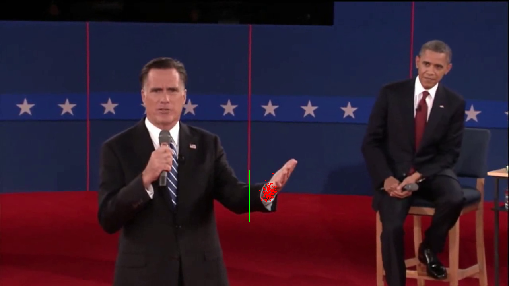
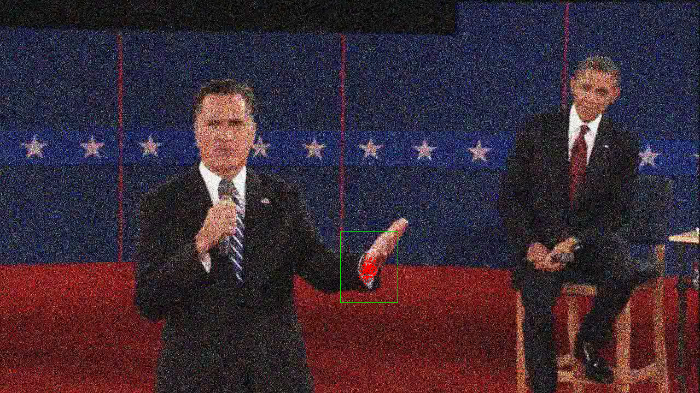

Tracking using particle filter 

Instructions for running the code 

C++ code make sure you have opencv installed.

 <h3> face tracking video link</h3>
 

 <h2> Face Tracking </h2>
 
 Face tracking at different Frame . 

 
  

 <h2> Face Tracking with Noise </h2>
 
 Face tracking at different Frame . 

 
  

 <h2> Hand Tracking  </h2> 

 question 2  .

 
  
 

 

 <h2> Hand Tracking with Noise   </h2> 

 question 2  .

 
  
 

 
 
