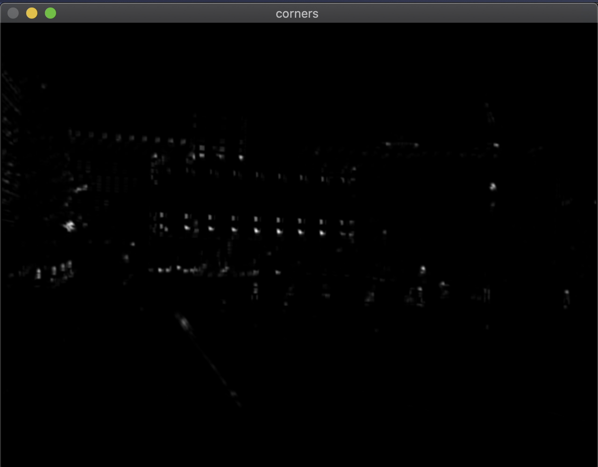

Harris corner python code 

instruction for running the code 

python3 harris_corner.py path_to_the_image

python3 harris_corner.py ./check_board.png

 <h2> Input image and output corner image</h2>
 
 
 

<h2> Non Maximum Supression </h2> 

 
 
 
 

